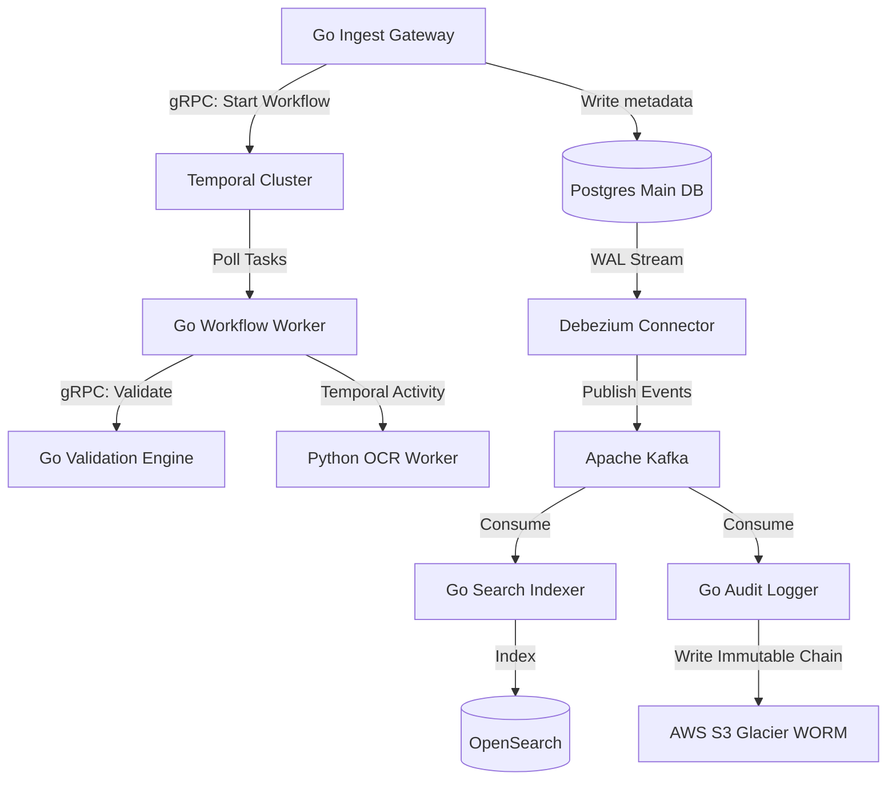
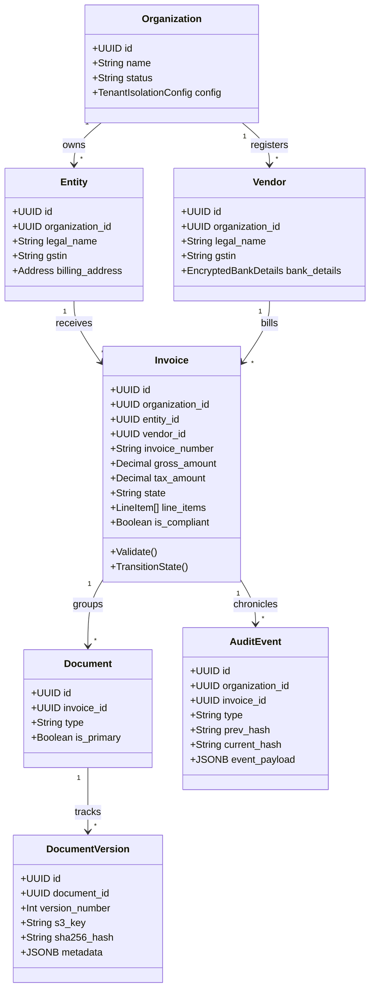

# Enterprise Multi-Tenant Invoice Compliance & Workflow SaaS
## Complete Production-Grade Architectural Blueprint & Systems Design

This document serves as the master systems architecture blueprint for the Enterprise Multi-Tenant Invoice Compliance & Workflow platform. It details a system built for millions of active documents, complex organizational structures, strict tax/ledger compliance rules, and cryptographic auditability.

---

### Critical Critique of the Architecture & Technology Stack

1. **PostgreSQL Multi-Tenancy**: While Shared Database + Row-Level Security (RLS) is highly cost-effective and developer-friendly, it suffers from the **noisy neighbor** problem at scale. 
   * *Alternative*: A **Hybrid Database Strategy**. Standard tenants share a Postgres instance using RLS, while enterprise-tier tenants are automatically provisioned on dedicated, physically isolated schemas or standalone RDS instances via an automated control plane router.
2. **Temporal Workflow Storage**: Temporal requires a backend database (like Postgres) to persist its history.
   * *Critical Decision*: Do NOT share the application PostgreSQL database (`invoice_saas`) with the Temporal state persistence database (`temporal`). Temporal's high-frequency write operations will saturate the connection pool and disk IOPS of the relational data store. We run a dedicated PostgreSQL/Aurora instance for Temporal state persistence.
3. **Python OCR Microservice Integration**: Direct REST/gRPC calls to Python OCR services from Go backend threads create blocking states.
   * *Alternative*: Model the Python OCR extraction as a **Temporal Activity Worker** written natively in Python. The Python worker registers with the central Temporal cluster, listens directly to the same `compliance-tasks` queue, pulls jobs, and executes layout extraction. This keeps Go non-blocking and achieves auto-scaling of GPU nodes based on task queue depth.
4. **CDC Event Replays**: Direct writes from Go to OpenSearch and Kafka bypass database transactional state integrity.
   * *Decision*: Use the **Transactional Outbox Pattern** combined with **Debezium CDC (Change Data Capture)**. Go writes events directly to a table in Postgres within the same ACID transaction as the invoice update. Debezium tails the Postgres WAL (Write-Ahead Log) and publishes events to Kafka safely.

---

## 1. System Architecture & Network Topology

The network layout enforces strict division of concerns into isolated security zones:

```
[Public Internet] 
       │ (WAF, DDoS Protection, Rate Limiting)
       ▼
┌────────────────────────────────────────────────────────────────────────┐
│ DMZ / Public Subnet (AWS Load Balancer, Kong API Gateway)              │
└────────────────────────────────────────────────────────────────────────┘
       │ (TLS Termination, JWT Signature Validation)
       ▼
┌────────────────────────────────────────────────────────────────────────┐
│ Private Application Zone (EKS Cluster)                                 │
│                                                                        │
│   ┌────────────────────┐   ┌────────────────────┐   ┌──────────────┐   │
│   │ Go Core API Pods   │   │ Go Temporal Workers│   │ Python Worker│   │
│   └────────────────────┘   └────────────────────┘   │ (GPU Nodes)  │   │
│             │                        │              └──────────────┘   │
└─────────────┼────────────────────────┼──────────────────────┼──────────┘
              │ (mTLS)                 │ (gRPC port 7233)     │
              ▼                        ▼                      │
┌─────────────────────────────────────────────────────────────┼──────────┐
│ Private Data Zone (VPC Isolated)                            │          │
│                                                             │          │
│  ┌─────────────────┐  ┌────────────────┐  ┌─────────────┐   │          │
│  │ Aurora Postgres │  │ Temporal DB    │  │ Redis Cache │◀──┘          │
│  │ (RLS + Partition)│  │ (State persistence)│  └─────────────┘              │
│  └─────────────────┘  └────────────────┘  ┌─────────────┐              │
│  ┌─────────────────┐  ┌────────────────┐  │ AWS KMS     │              │
│  │ Kafka Cluster   │◀─│ OpenSearch     │  │ (Envelope)  │              │
│  └─────────────────┘  └────────────────┘  └─────────────┘              │
└────────────────────────────────────────────────────────────────────────┘
```

---

## 2. Service Architecture

The SaaS platform comprises six decoupled microservices interacting through typed gRPC interfaces and Kafka event streams:



* **Go Ingest Gateway**: Validates JWT, issues S3 signed URLs, writes preliminary metadata, and triggers Temporal workflows.
* **Go Temporal Worker**: Executes the invoice orchestration state engine.
* **Python OCR Worker**: A native Python Temporal worker consuming layout-extraction tasks; deployed on AWS EKS GPU nodes with Karpenter autoscaling.
* **Go Validation Engine**: Stateless evaluation engine for matching invoice amount, vendor GSTIN, and PO line items.
* **Debezium Connector**: Streams transactional outbox records from PostgreSQL WAL to Apache Kafka.
* **Go Search Indexer**: Replicates document attributes and parsed text metadata to OpenSearch.

---

## 3. Domain Model & Aggregate Boundaries



### Business Rules & Aggregate Invariants:
1. **Invoice Integrity**: `Invoice.gross_amount` must equal the sum of `LineItem.net_amount` + `LineItem.tax_amount`.
2. **GSTIN Invariant**: For Indian entities, the vendor and billing entity must possess formatted 15-digit GSTIN tax identifiers.
3. **Approval Rules**: An invoice with `gross_amount > $10,000` must proceed to `CFOApproval` after receiving `Manager` and `Finance` approvals.
4. **Tenant Isolation Bounds**: Queries must include a `tenant_id` session parameter context. No domain objects can bypass this validation boundaries.

---

## 4. Database Schema (PostgreSQL Partitioned DDL)

We use **range partitioning by date** combined with **Row-Level Security (RLS)**. This prevents slow indexes as historic invoice counts grow to tens of millions.

```sql
-- Enable Extensions
CREATE EXTENSION IF NOT EXISTS "uuid-ossp";

-- 1. Organizations (Tenants)
CREATE TABLE organizations (
    id UUID PRIMARY KEY DEFAULT uuid_generate_v4(),
    name VARCHAR(255) NOT NULL,
    status VARCHAR(50) DEFAULT 'ACTIVE',
    created_at TIMESTAMP WITH TIME ZONE DEFAULT CURRENT_TIMESTAMP
);

-- 2. Entities (Legal entities belonging to a tenant)
CREATE TABLE entities (
    id UUID PRIMARY KEY DEFAULT uuid_generate_v4(),
    organization_id UUID NOT NULL REFERENCES organizations(id) ON DELETE CASCADE,
    legal_name VARCHAR(255) NOT NULL,
    tax_identifier VARCHAR(15) NOT NULL,
    address JSONB NOT NULL,
    created_at TIMESTAMP WITH TIME ZONE DEFAULT CURRENT_TIMESTAMP,
    CONSTRAINT uq_entity_gstin UNIQUE (organization_id, tax_identifier)
);
CREATE INDEX idx_entities_org ON entities(organization_id);

-- 3. Vendors
CREATE TABLE vendors (
    id UUID PRIMARY KEY DEFAULT uuid_generate_v4(),
    organization_id UUID NOT NULL REFERENCES organizations(id) ON DELETE CASCADE,
    legal_name VARCHAR(255) NOT NULL,
    tax_identifier VARCHAR(15) NOT NULL,
    bank_details JSONB, -- KMS envelope encrypted
    status VARCHAR(50) DEFAULT 'APPROVED',
    created_at TIMESTAMP WITH TIME ZONE DEFAULT CURRENT_TIMESTAMP,
    CONSTRAINT uq_vendor_gstin UNIQUE (organization_id, tax_identifier)
);
CREATE INDEX idx_vendors_org ON vendors(organization_id);

-- 4. Invoices (Range Partitioned by Invoice Date)
CREATE TABLE invoices (
    id UUID NOT NULL,
    organization_id UUID NOT NULL REFERENCES organizations(id) ON DELETE CASCADE,
    entity_id UUID NOT NULL,
    vendor_id UUID NOT NULL,
    invoice_number VARCHAR(100) NOT NULL,
    invoice_date DATE NOT NULL,
    gross_amount NUMERIC(15, 4) NOT NULL,
    tax_amount NUMERIC(15, 4) NOT NULL,
    currency CHAR(3) NOT NULL,
    current_state VARCHAR(100) NOT NULL,
    created_at TIMESTAMP WITH TIME ZONE DEFAULT CURRENT_TIMESTAMP,
    updated_at TIMESTAMP WITH TIME ZONE DEFAULT CURRENT_TIMESTAMP,
    PRIMARY KEY (id, invoice_date)
) PARTITION BY RANGE (invoice_date);

-- Example Partitions for 2026
CREATE TABLE invoices_y2026m01 PARTITION OF invoices
    FOR VALUES FROM ('2026-01-01') TO ('2026-02-01');
CREATE TABLE invoices_y2026m02 PARTITION OF invoices
    FOR VALUES FROM ('2026-02-01') TO ('2026-03-01');
CREATE TABLE invoices_y2026m03 PARTITION OF invoices
    FOR VALUES FROM ('2026-03-01') TO ('2026-04-01');
CREATE TABLE invoices_y2026m06 PARTITION OF invoices
    FOR VALUES FROM ('2026-06-01') TO ('2026-07-01');

CREATE INDEX idx_invoices_partition_org ON invoices(organization_id);
CREATE INDEX idx_invoices_lookup_part ON invoices(entity_id, current_state);

-- 5. Transactional Outbox (Used for CDC replication)
CREATE TABLE transactional_outbox (
    id UUID PRIMARY KEY DEFAULT uuid_generate_v4(),
    organization_id UUID NOT NULL,
    aggregate_type VARCHAR(100) NOT NULL,
    aggregate_id UUID NOT NULL,
    event_type VARCHAR(100) NOT NULL,
    payload JSONB NOT NULL,
    created_at TIMESTAMP WITH TIME ZONE DEFAULT CURRENT_TIMESTAMP
);
CREATE INDEX idx_outbox_created ON transactional_outbox(created_at);

-- Row Level Security (RLS) policies activation
ALTER TABLE entities ENABLE ROW LEVEL SECURITY;
ALTER TABLE vendors ENABLE ROW LEVEL SECURITY;
ALTER TABLE invoices ENABLE ROW LEVEL SECURITY;

CREATE POLICY tenant_entities_policy ON entities
    USING (organization_id = NULLIF(current_setting('app.current_tenant_id', true), '')::UUID);

CREATE POLICY tenant_vendors_policy ON vendors
    USING (organization_id = NULLIF(current_setting('app.current_tenant_id', true), '')::UUID);

CREATE POLICY tenant_invoices_policy ON invoices
    USING (organization_id = NULLIF(current_setting('app.current_tenant_id', true), '')::UUID);

---

## 5. API Design (gRPC & REST)

The platform exposes REST APIs via Kong Gateway (which transcodes REST to gRPC for internal services) to ensure developer friendliness for third-party integrations, while maintaining high-performance gRPC internally.

### Core Endpoints

**1. Invoice Ingestion (REST to gRPC)**
`POST /api/v1/invoices/upload`
- **Payload**: Multipart form-data containing the PDF/Image and optional user metadata.
- **Response**: `202 Accepted` with `workflow_id` (Temporal Run ID).
- **Behavior**: Gateway issues a presigned S3 PUT URL to the client. Once uploaded, the client calls `/api/v1/invoices/trigger` to start the extraction workflow.

**2. Invoice Query**
`GET /api/v1/invoices/{invoice_id}`
- **Headers**: `X-Tenant-ID`, `Authorization: Bearer <JWT>`
- **Response**: Full invoice JSON including extracted Line Items, Tax splits, and current Workflow State.

**3. Webhook Registration**
`POST /api/v1/webhooks`
- **Payload**: `{"url": "...", "events": ["invoice.approved", "invoice.rejected"]}`
- **Behavior**: Registers an endpoint for tenant-specific CDC events.

---

## 6. Temporal Workflow Design

Temporal manages the non-blocking, distributed state machine of the invoice lifecycle.

### Workflow: `ProcessInvoiceWorkflow`
**Input**: `S3_URI`, `TenantID`, `UploadedBy`

1. **Activity: `ExtractTextAndLayout`** (Python Worker)
   - Runs on EKS GPU nodes using LayoutLMv3.
   - Idempotent and retriable (Timeout: 5m).
2. **Activity: `ValidateExtractedData`** (Go Worker)
   - Checks math (`Gross == Net + Tax`).
   - Cross-references GSTINs against Tenant's Entity/Vendor registries.
3. **Signal Handler: `WaitForHumanReview`**
   - If confidence < 95% or math fails, workflow pauses.
   - Waits for a UI signal containing corrected JSON.
4. **Activity: `ExecuteApprovalRules`** (Go Worker)
   - Evaluates tenant-specific rules (e.g., "If > $10k, requires CFO approval").
5. **Activity: `PublishToERP`** (Go Worker)
   - Syncs final approved invoice to SAP/Oracle via tenant integration settings.

---

## 7. Event Model (Kafka & CDC)

All domain events are captured via Debezium tailing the Postgres WAL (Outbox table) and published to Kafka.

### Topics
- `tenant.invoice.events` (Partitioned by `TenantID`)
- `system.audit.logs`

### Event Schema (CloudEvents Format)
```json
{
  "specversion": "1.0",
  "type": "com.saas.invoice.state_changed",
  "source": "/service/temporal-worker",
  "subject": "invoice-uuid",
  "id": "event-uuid",
  "time": "2026-06-22T10:00:00Z",
  "datacontenttype": "application/json",
  "data": {
    "tenant_id": "org-uuid",
    "previous_state": "EXTRACTED",
    "new_state": "PENDING_APPROVAL",
    "gross_amount": 475663.00,
    "vendor_gstin": "06AAAAA0017A1ZH"
  }
}
```

---

## 8. Audit Architecture

Compliance is the core value proposition. Every state change must be cryptographically verifiable.

1. **Immutable Log**: Audit logs are written to an append-only PostgreSQL table and simultaneously pushed to Kafka.
2. **Hash Chaining**: Each audit event contains a `SHA-256` hash of its payload and the `prev_hash` of the preceding event for that invoice, creating a localized blockchain.
3. **WORM Storage**: The audit Kafka topic is sunk directly to **AWS S3 Glacier Object Lock (WORM - Write Once Read Many)**. This proves to auditors that logs haven't been tampered with since creation.

---

## 9. Security Architecture

1. **Network**: VPC with private subnets. No DB or Worker is exposed to the internet. API Gateway acts as the single ingress point.
2. **Encryption at Rest**: AWS KMS Customer Managed Keys (CMK).
   - Envelope Encryption for PII/Bank Details: A unique Data Key is generated per tenant to encrypt bank details. If a tenant deletes their account, the key is destroyed (Crypto-shredding).
3. **Encryption in Transit**: Strict mTLS between all microservices. TLS 1.3 for external API traffic.
4. **AuthN & AuthZ**: Auth0 / Okta for Identity. JWT tokens carry `tenant_id` claims. Open Policy Agent (OPA) sidecars evaluate RBAC policies per gRPC call.

---

## 10. Scaling Strategy

1. **Stateless Tier (Go API)**: Kubernetes Horizontal Pod Autoscaler (HPA) triggers on CPU/Memory.
2. **Worker Tier (Temporal)**: Scaled based on Temporal Queue Depth.
3. **Database Tier (Postgres)**: 
   - Read Replicas handles heavy analytical queries.
   - Partitioning prevents index bloat.
   - Connection Pooling via PgBouncer prevents connection exhaustion.
4. **Search Tier**: OpenSearch cluster scaled independently based on indexing volume and search query load.

---

## 11. Cost Optimization Strategy

1. **Spot Instances for AI Workers**: The Python LayoutLMv3 EKS worker nodes run on AWS Spot Instances. If a node is preempted, Temporal simply re-queues the idempotent extraction activity to another node.
2. **Tiered Storage**: 
   - Active Invoices (0-30 days): Postgres & Hot S3.
   - Archived Invoices (30+ days): Data moved to S3 Glacier, pointers kept in Postgres.
3. **Graviton (ARM) Processors**: Run all Go microservices on AWS Graviton3 instances for 20-30% price-performance improvement.

---

## 12. Failure Recovery Strategy

1. **Database Failover**: Aurora Postgres Multi-AZ deployments with automatic failover (typically < 30s).
2. **Workflow Failures**: Temporal guarantees state preservation. If a Go worker crashes midway, Temporal reschedules the activity from the last known state.
3. **Dead Letter Queues (DLQ)**: Failed Kafka events (e.g., webhook delivery failures) are routed to a DLQ. A cron job exposes these to a dashboard for manual replay.

---

## 13. Multi-Region Strategy

**Active-Passive Topology**
- **Primary Region**: `ap-south-1` (Mumbai)
- **DR Region**: `ap-southeast-1` (Singapore)

**Replication Details**:
- Postgres: Cross-region read replica.
- S3: Cross-region replication (CRR) enabled for all buckets.
- Temporal: Namespace replication via Temporal's Multi-Cluster Replication feature.
- **RPO (Recovery Point Objective)**: < 1 minute.
- **RTO (Recovery Time Objective)**: < 15 minutes.

---

## 14. Recommended MVP Scope

Do NOT build everything for V1. Focus on the core value:
1. **Tenants**: Shared database with RLS.
2. **Ingestion**: Basic API and UI upload. No email scraping yet.
3. **Extraction**: Single LayoutLMv3 worker, falling back to manual Human-in-the-Loop review.
4. **Workflow**: Hardcoded approval steps (Extracted -> Manager Approval -> Paid). No dynamic rule engine.
5. **Audit**: Simple chronological table in Postgres. No hash chaining or WORM storage yet.

---

## 15. Recommended V2 Architecture (Future Vision)

1. **Control Plane Isolation**: Move to a true Control Plane / Data Plane model where Enterprise tenants get isolated single-tenant environments managed by a Kubernetes Operator.
2. **Dynamic Rule Engine**: Implement a DSL (Domain Specific Language) allowing tenants to visually build Temporal workflows.
3. **AI Agents**: Replace deterministic validation with LLM Agents capable of interpreting complex discrepancy notes (e.g., automatically resolving Gate Entry vs Invoice mismatches).
4. **Blockchain Audit**: Publish the Merkle root of daily audit logs to a public blockchain (e.g., Ethereum) for absolute non-repudiation.
